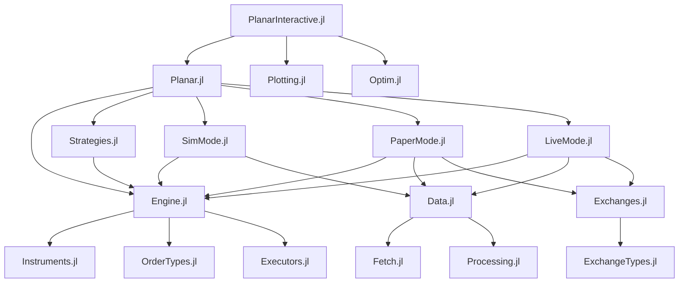
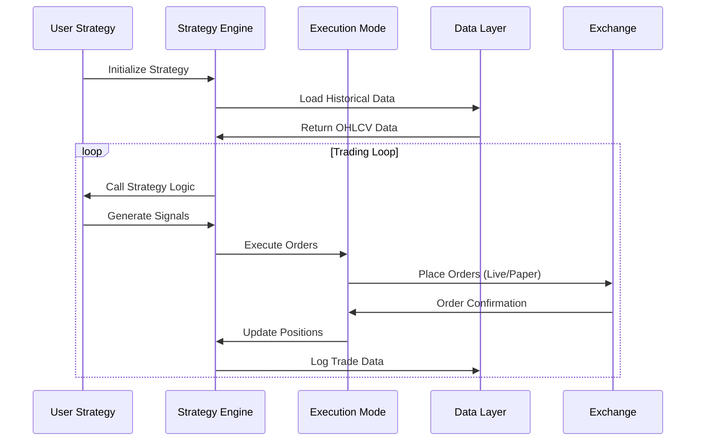

# Development Documentation

This comprehensive guide covers Planar's architecture, development setup, contribution guidelines, and best practices for extending the framework.

## Architecture Overview

### System Architecture

Planar follows a modular architecture with clear separation of concerns:

```
┌─────────────────────────────────────────────────────────────┐
│                    User Interface Layer                     │
├─────────────────────────────────────────────────────────────┤
│  Planar.jl (Main)  │  PlanarInteractive.jl  │  CLI Tools   │
├─────────────────────────────────────────────────────────────┤
│                    Strategy Layer                           │
├─────────────────────────────────────────────────────────────┤
│   Strategies.jl    │    User Strategies     │  StrategyStats│
├─────────────────────────────────────────────────────────────┤
│                    Execution Layer                          │
├─────────────────────────────────────────────────────────────┤
│  SimMode.jl  │  PaperMode.jl  │  LiveMode.jl  │ Executors.jl│
├─────────────────────────────────────────────────────────────┤
│                    Data & Exchange Layer                    │
├─────────────────────────────────────────────────────────────┤
│ Exchanges.jl │ Data.jl │ Fetch.jl │ Processing.jl │ Metrics.jl│
├─────────────────────────────────────────────────────────────┤
│                    Foundation Layer                         │
├─────────────────────────────────────────────────────────────┤
│Engine.jl│Instruments.jl│OrderTypes.jl│Collections.jl│Lang.jl│
└─────────────────────────────────────────────────────────────┘
```

### Core Components

#### Engine Module
The foundation of Planar, providing:
- **Asset Management**: `AbstractAsset`, `Asset`, `Derivative` types
- **Instance System**: `AssetInstance` linking assets to exchanges
- **Strategy Framework**: `Strategy{Mode}` parametric types
- **Core Abstractions**: Base types and interfaces

#### Execution Modes
Three distinct execution environments:
- **SimMode**: Fast synchronous backtesting with OHLCV data
- **PaperMode**: Real-time simulation with live data feeds
- **LiveMode**: Actual trading with exchange APIs

#### Data Pipeline
Comprehensive data management:
- **Fetch**: Data acquisition from exchanges and external sources
- **Processing**: Data cleaning, resampling, and transformation
- **Storage**: Zarr-based large dataset storage with LMDB indexing
- **Watchers**: Real-time data monitoring and alerting

#### Exchange Integration
Unified exchange interface:
- **CCXT Integration**: 100+ exchange support via Ccxt.jl
- **Custom Exchanges**: Framework for implementing proprietary APIs
- **Order Management**: Unified order types across exchanges

### Module Relationships



### Data Flow Architecture



## Development Setup

### Prerequisites

- **Julia 1.11+**: Latest stable Julia version
- **Git**: With submodule support
- **Python 3.8+**: For CCXT integration (managed via CondaPkg)
- **Docker** (optional): For containerized development

### Initial Setup

1. **Clone Repository**:
```bash
git clone --recurse-submodules https://github.com/defnlnotme/Planar.jl
cd Planar.jl
```

2. **Environment Setup**:
```bash
# Enable direnv (recommended)
direnv allow

# Or manually set environment
export JULIA_PROJECT=Planar
export JULIA_NUM_THREADS=$(nproc)
```

3. **Install Dependencies**:
```julia
# Start Julia in project
julia --project=Planar

# Install all dependencies
] instantiate

# Verify installation
using Planar
```

### Development Environment

#### Recommended Julia Setup

```julia
# In your Julia startup file (~/.julia/config/startup.jl)
using Pkg
if isfile("Project.toml")
    Pkg.activate(".")
end

# Enable development mode
ENV["JULIA_DEBUG"] = "Planar"
```

#### IDE Configuration

**VS Code with Julia Extension**:
```json
{
    "julia.environmentPath": "Planar",
    "julia.enableTelemetry": false,
    "julia.execution.resultDisplay": "both",
    "julia.lint.run": true,
    "julia.format.indent": 4,
    "julia.format.margin": 92
}
```

**Vim/Neovim with LanguageServer.jl**:
```lua
require'lspconfig'.julials.setup{
    settings = {
        julia = {
            environmentPath = "Planar",
            format = {
                indent = 4,
                margin = 92
            }
        }
    }
}
```

## PlanarDev Utilities

The `PlanarDev` package assists developers by providing helper functions for working with Planar and for conducting tests.

### Precompilation Control

To skip precompilation for selected modules, set the `JULIA_NOPRECOMP` environment variable:

```julia
ENV["JULIA_NOPRECOMP"] = (:Planar, :Scrapers, :Engine, :Watchers, :Plotting, :Metrics)
```

Alternatively, you can manage environment variables with `direnv` (refer to the `.envrc` in the repository). To disable precompilation entirely for certain packages, use `JULIA_NOPRECOMP=all`. This is recommended only when altering low-level components of the module stack. Remember to clear the compilation cache when changing precompilation settings:

```julia
include("resolve.jl")
purge_compilecache() # Pass a package name as an argument to clear its specific cache.
```

The `Exchanges` and `Fetch` packages contain a `compile.jl` file to generate precompile statements using [CompileBot.jl](https://github.com/aminya/CompileBot.jl). This is particularly useful for precompilation tasks that involve numerous web requests. However, this method is not currently used as it does not compile as many methods as `PrecompileTools`.

!!! warning "Custom Precompilation"
    For custom method precompilation, enclose your code with `py_start_loop` and `py_stop_loop` from the Python package to prevent Pkg from stalling due to lingering threads.
    ```julia
    using PrecompileTools
    Python.py_stop_loop() # Stop the Python loop if it's running
    Python.py_start_loop()
    @precompile_workload $(myworkload...)
    Python.py_stop_loop()
    ```

### Method Invalidation Strategy

The order of `using ...` statements when loading modules can influence method invalidation. To minimize invalidation, arrange the module imports starting with the ones most likely to cause invalidations to the ones least likely. For instance, placing `using Python` at the beginning can expedite loading times:

```julia
# Load modules that heavily trigger invalidations first
using Python
using Ccxt
# Load less impactful modules later
using Timeticks
using Lang
```

Modules known for heavy invalidations:

- Python
- Ccxt (initiates the Python async loop)
- Data (relies on Zarr and DataFrames)
- Plots (depends on Makie)

To reduce invalidations, include external modules in only one local package and then use that package as a dependency in other local packages. For instance, if `DataFrames` is a dependency of the local package `Data`, and you want to use `DataFrames` in the `Stats` package, do not add `DataFrames` to `Stats` dependencies. Instead, use `Data` and import `DataFrames` from there:

```julia
module Metrics

using Data.DataFrames

# ...
end
```

### Handling Segfaults

In rare cases involving complex multi-threaded scenarios, disable and re-enable the garbage collector (GC) around the loading of Planar to avoid segmentation faults:

```julia
GC.enable(false)
using Planar
s = st.strategy()
GC.enable(true)
GC.gc()
```

Refer to https://github.com/cjdoris/PythonCall.jl/issues/201 for more details.

### Dependency Management

When adding dependencies, ensure that a dependency is only included in one subpackage. If you need the same dependency in another subpackage, add the first subpackage as the dependency, not the external module.

The order of `using` or `import` statements within packages is crucial. Always import external dependencies before internal ones to minimize method invalidations.

## Contribution Guidelines

### Code Style and Standards

#### Julia Formatting
Planar uses JuliaFormatter with Blue style:

```julia
# Install JuliaFormatter
] add JuliaFormatter

# Format code
using JuliaFormatter
format(".", BlueStyle(), margin=92)
```

Configuration in `.JuliaFormatter.toml`:
```toml
style = "blue"
margin = 92
indent = 4
always_for_in = true
whitespace_typedefs = true
whitespace_ops_in_indices = true
remove_extra_newlines = true
```

#### Naming Conventions

- **Types**: PascalCase (`MyCustomType`)
- **Functions**: snake_case (`my_function`)
- **Constants**: UPPER_CASE (`MY_CONSTANT`)
- **Modules**: PascalCase (`MyModule`)
- **Variables**: snake_case (`my_variable`)

#### Documentation Standards

All public functions must have docstrings:

```julia
"""
    my_function(arg1::Type1, arg2::Type2; kwarg1=default) -> ReturnType

Brief description of what the function does.

# Arguments
- `arg1::Type1`: Description of first argument
- `arg2::Type2`: Description of second argument
- `kwarg1=default`: Description of keyword argument

# Returns
- `ReturnType`: Description of return value

# Examples
```julia
result = my_function(value1, value2; kwarg1=custom_value)
```

# See Also
- [`related_function`](@ref): Related functionality
"""
function my_function(arg1::Type1, arg2::Type2; kwarg1=default)
    # Implementation
end
```

### Testing Patterns

#### Unit Testing Structure

```julia
# test/test_mymodule.jl
using Test
using MyModule

@testset "MyModule Tests" begin
    @testset "Basic Functionality" begin
        @test my_function(1, 2) == 3
        @test_throws ArgumentError my_function(-1, 2)
    end
    
    @testset "Edge Cases" begin
        @test my_function(0, 0) == 0
        @test isnan(my_function(Inf, -Inf))
    end
    
    @testset "Performance" begin
        @test @allocated(my_function(1, 2)) == 0
    end
end
```

#### Integration Testing

```julia
# test/integration/test_strategy_execution.jl
using Test
using Planar

@testset "Strategy Execution Integration" begin
    # Setup test environment
    strategy = create_test_strategy()
    asset_instance = create_test_asset()
    
    @testset "Simulation Mode" begin
        sim_strategy = Strategy{Sim}(strategy)
        result = backtest!(sim_strategy, asset_instance, test_data)
        
        @test result.total_return > 0
        @test length(result.trades) > 0
    end
    
    @testset "Paper Mode" begin
        paper_strategy = Strategy{Paper}(strategy)
        # Test paper trading logic
    end
end
```

#### Property-Based Testing

```julia
using Test
using Random

@testset "Property-Based Tests" begin
    @testset "Order Validation Properties" begin
        for _ in 1:100
            # Generate random valid inputs
            amount = rand() * 1000
            price = rand() * 100
            
            order = create_order(amount, price)
            
            # Test properties that should always hold
            @test order.amount ≈ amount
            @test order.price ≈ price
            @test is_valid_order(order)
        end
    end
end
```

### Extension Best Practices

#### Creating New Modules

1. **Module Structure**:
```
MyNewModule/
├── Project.toml
├── Manifest.toml
├── src/
│   ├── MyNewModule.jl
│   ├── types.jl
│   ├── functions.jl
│   └── utils.jl
├── test/
│   ├── runtests.jl
│   └── test_functions.jl
└── README.md
```

2. **Project.toml Template**:
```toml
name = "MyNewModule"
uuid = "generate-new-uuid"
authors = ["Your Name <your.email@example.com>"]
version = "0.1.0"

[deps]
# Only essential dependencies
Engine = {path = "../Engine"}

[compat]
julia = "1.11"
```

3. **Module Definition**:
```julia
# src/MyNewModule.jl
module MyNewModule

using Engine
using Engine: Strategy, AssetInstance

# Export public interface
export my_public_function, MyPublicType

# Include submodules
include("types.jl")
include("functions.jl")
include("utils.jl")

end # module
```

#### Implementing Custom Strategies

```julia
# Define strategy type
struct MyCustomStrategy <: AbstractStrategy
    parameter1::Float64
    parameter2::Int
    
    function MyCustomStrategy(param1=1.0, param2=10)
        new(param1, param2)
    end
end

# Implement required interface
function generate_signals(
    strategy::MyCustomStrategy,
    ai::AssetInstance,
    date::DateTime
)
    # Strategy logic here
    return signal_value
end

function position_sizing(
    strategy::MyCustomStrategy,
    ai::AssetInstance,
    signal::Float64
)
    # Position sizing logic
    return position_size
end
```

#### Performance Optimization Guidelines

1. **Type Stability**:
```julia
# Good: Type-stable function
function fast_calculation(x::Float64)::Float64
    return x * 2.0 + 1.0
end

# Avoid: Type-unstable function
function slow_calculation(x)
    if x > 0
        return x * 2.0
    else
        return "negative"  # Type instability
    end
end
```

2. **Memory Allocation**:
```julia
# Good: Pre-allocate arrays
function efficient_processing!(output::Vector{Float64}, input::Vector{Float64})
    @inbounds for i in eachindex(input, output)
        output[i] = process_element(input[i])
    end
    return output
end

# Avoid: Allocating in loops
function inefficient_processing(input::Vector{Float64})
    output = Float64[]
    for x in input
        push!(output, process_element(x))  # Allocates on each iteration
    end
    return output
end
```

3. **Benchmarking**:
```julia
using BenchmarkTools

# Benchmark your functions
@benchmark my_function(test_data)

# Profile memory usage
@time my_function(test_data)

# Check for type instabilities
@code_warntype my_function(test_data)
```

### Debugging and Profiling

#### Debugging Strategies

1. **Logging**:
```julia
using Logging

@debug "Debug information" variable_value
@info "General information" 
@warn "Warning message" problematic_value
@error "Error occurred" exception=e
```

2. **Interactive Debugging**:
```julia
using Debugger

# Set breakpoint
@bp

# Or use Infiltrator for lightweight debugging
using Infiltrator
@infiltrate  # Drops into REPL at this point
```

3. **Testing Utilities**:
```julia
# Test with different data
test_data = generate_test_data(1000)
result = my_function(test_data)

# Validate results
@assert all(isfinite, result) "Result contains non-finite values"
@assert length(result) == length(test_data) "Length mismatch"
```

#### Performance Profiling

```julia
using Profile, ProfileView

# Profile your code
@profile begin
    for i in 1:1000
        my_function(test_data)
    end
end

# View results
ProfileView.view()

# Or use PProf for flame graphs
using PProf
pprof()
```

### Continuous Integration

#### GitHub Actions Workflow

```yaml
# .github/workflows/ci.yml
name: CI
on:
  push:
    branches: [main, develop]
  pull_request:
    branches: [main]

jobs:
  test:
    runs-on: ubuntu-latest
    strategy:
      matrix:
        julia-version: ['1.11', '1.12']
    
    steps:
    - uses: actions/checkout@v3
      with:
        submodules: recursive
    
    - uses: julia-actions/setup-julia@v1
      with:
        version: ${{ matrix.julia-version }}
    
    - uses: julia-actions/cache@v1
    
    - uses: julia-actions/julia-buildpkg@v1
      with:
        project: Planar
    
    - uses: julia-actions/julia-runtest@v1
      with:
        project: Planar
    
    - uses: julia-actions/julia-processcoverage@v1
    
    - uses: codecov/codecov-action@v3
```

### Release Process

#### Version Management

1. **Semantic Versioning**: Follow SemVer (MAJOR.MINOR.PATCH)
   - MAJOR: Breaking changes
   - MINOR: New features, backward compatible
   - PATCH: Bug fixes, backward compatible

2. **Release Checklist**:
   - [ ] Update version in Project.toml
   - [ ] Update CHANGELOG.md
   - [ ] Run full test suite
   - [ ] Update documentation
   - [ ] Create release tag
   - [ ] Build and test Docker images

#### Documentation Updates

```julia
# Generate documentation
using Documenter

makedocs(
    sitename = "Planar.jl",
    format = Documenter.HTML(),
    modules = [Planar],
    pages = [
        "Home" => "index.md",
        "Getting Started" => [
            "getting-started/installation.md",
            "getting-started/quick-start.md"
        ],
        "API Reference" => "api.md"
    ]
)
```

### Community Guidelines

#### Issue Reporting

When reporting issues, include:
- Julia version and Planar version
- Minimal reproducible example
- Expected vs actual behavior
- Error messages and stack traces
- System information (OS, architecture)

#### Pull Request Process

1. Fork the repository
2. Create feature branch from `develop`
3. Make changes with tests
4. Update documentation
5. Submit pull request with clear description
6. Address review feedback
7. Merge after approval

#### Code Review Standards

- **Functionality**: Does the code work as intended?
- **Performance**: Are there performance implications?
- **Style**: Does it follow project conventions?
- **Tests**: Are there adequate tests?
- **Documentation**: Is it properly documented?
- **Breaking Changes**: Are breaking changes justified and documented?

This comprehensive development guide ensures consistent, high-quality contributions to the Planar ecosystem.
```