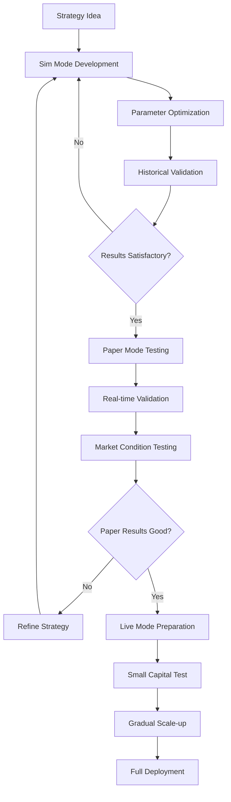

# Execution Mode Comparison and Transition Guide

This guide provides a comprehensive comparison of Planar's three execution modes (Sim, Paper, and Live) and guidance on safely transitioning between them.

## Mode Overview

Planar supports three distinct execution modes, each designed for different stages of strategy development and deployment:

- **Sim Mode (Simulation/Backtesting)**: Historical data simulation for strategy development and testing
- **Paper Mode**: Real-time simulation with live market data but no actual trades
- **Live Mode**: Real trading with actual capital and exchange APIs

## Detailed Mode Comparison

### Feature Comparison Matrix

| Feature | Sim Mode | Paper Mode | Live Mode |
|---------|----------|------------|-----------|
| **Data Source** | Historical | Live Market Data | Live Market Data |
| **Order Execution** | Simulated | Simulated | Real Exchange API |
| **Capital Risk** | None | None | Real Money |
| **Market Impact** | None | None | Real |
| **Latency** | None | Real Network | Real Network + Exchange |
| **Slippage** | Modeled | Modeled from Order Book | Real Market Slippage |
| **Fees** | Modeled | Modeled | Real Exchange Fees |
| **Order Book** | Historical/Modeled | Real-time | Real-time |
| **Speed** | Very Fast | Real-time | Real-time |
| **API Limits** | None | Rate Limited | Rate Limited |
| **Funding Costs** | Modeled | Modeled | Real |

### Execution Characteristics

#### Sim Mode (Backtesting)
```julia
# Sim mode characteristics
s = strategy(:Example, mode=Sim())

# Advantages:
# - Extremely fast execution (millions of candles per minute)
# - No API rate limits
# - Perfect for parameter optimization
# - Deterministic results
# - Historical data analysis

# Limitations:
# - No real market conditions
# - Simplified order execution
# - No network latency
# - Perfect information assumption
```

**Best Use Cases:**
- Strategy development and debugging
- Parameter optimization
- Historical performance analysis
- Backtesting across multiple time periods
- Monte Carlo simulations

**Performance Characteristics:**
- Speed: ~3.9M candles in 8 seconds (single core)
- Memory: 2-8GB depending on data size
- Scalability: Excellent for large datasets

#### Paper Mode
```julia
# Paper mode characteristics
s = strategy(:Example, mode=Paper())

# Advantages:
# - Real market data and conditions
# - Realistic order book simulation
# - Network latency included
# - Real-time strategy validation
# - No capital risk

# Limitations:
# - No market impact modeling
# - Simplified execution assumptions
# - May not capture all edge cases
# - Limited to current market conditions
```

**Best Use Cases:**
- Strategy validation with live data
- Real-time performance monitoring
- Market condition adaptation testing
- Pre-live deployment validation
- Strategy parameter fine-tuning

**Performance Characteristics:**
- Speed: Real-time (limited by market data frequency)
- Memory: 1-4GB depending on complexity
- Latency: Network + processing delays

#### Live Mode
```julia
# Live mode characteristics
s = strategy(:Example, mode=Live())

# Advantages:
# - Real market execution
# - Actual slippage and fees
# - True market impact
# - Real funding costs
# - Complete market realism

# Limitations:
# - Capital at risk
# - API rate limits
# - Exchange-specific quirks
# - Potential for real losses
# - Regulatory considerations
```

**Best Use Cases:**
- Production trading
- Real capital deployment
- Market making strategies
- Arbitrage opportunities
- Professional trading operations

**Performance Characteristics:**
- Speed: Limited by exchange APIs
- Memory: 1-2GB for typical strategies
- Latency: Network + exchange processing

## Transition Strategies

### Development Workflow

The recommended development workflow follows a systematic progression through all three modes:



### Sim to Paper Transition

#### Pre-transition Checklist

```julia
# Validate sim mode results before transitioning
function validate_sim_results(s)
    checklist = Dict(
        :positive_returns => total_return(s) > 0,
        :reasonable_sharpe => sharpe_ratio(s) > 1.0,
        :max_drawdown_acceptable => max_drawdown(s) < 0.2,
        :sufficient_trades => length(s.trades) > 100,
        :win_rate_reasonable => win_rate(s) > 0.4,
        :profit_factor_good => profit_factor(s) > 1.2
    )
    
    passed = all(values(checklist))
    
    if !passed
        @warn "Sim validation failed" checklist
        return false
    end
    
    @info "Sim validation passed" checklist
    return true
end

# Example transition
if validate_sim_results(sim_strategy)
    # Create paper mode version
    paper_strategy = strategy(:Example, mode=Paper())
    
    # Copy configuration
    copy_strategy_config!(paper_strategy, sim_strategy)
    
    # Start paper trading
    start!(paper_strategy)
else
    @error "Strategy not ready for paper mode"
end
```

#### Configuration Adjustments

```julia
# Adjust configuration for paper mode
function prepare_for_paper_mode(s)
    # Reduce position sizes for safety
    s.config.base_size *= 0.5
    
    # Add more conservative risk management
    s.config.max_position_size = min(s.config.max_position_size, 0.1)
    s.config.stop_loss_pct = max(s.config.stop_loss_pct, 0.02)
    
    # Enable detailed logging
    s.config.log_level = :debug
    s.config.log_trades = true
    s.config.log_orders = true
    
    # Set up monitoring
    s.config.monitor_performance = true
    s.config.alert_on_losses = true
    
    return s
end
```

### Paper to Live Transition

#### Comprehensive Validation

```julia
# Validate paper mode performance before going live
function validate_paper_performance(s, min_days=30)
    # Check minimum testing period
    trading_days = calculate_trading_days(s)
    if trading_days < min_days
        @error "Insufficient paper trading period: $trading_days days (minimum: $min_days)"
        return false
    end
    
    # Performance metrics validation
    metrics = calculate_performance_metrics(s)
    
    validation_criteria = Dict(
        :positive_pnl => metrics.total_pnl > 0,
        :consistent_performance => metrics.consistency_score > 0.6,
        :acceptable_drawdown => metrics.max_drawdown < 0.15,
        :good_sharpe => metrics.sharpe_ratio > 0.8,
        :sufficient_trades => metrics.total_trades > 50,
        :stable_win_rate => metrics.win_rate > 0.35,
        :low_volatility => metrics.return_volatility < 0.3
    )
    
    passed_criteria = sum(values(validation_criteria))
    total_criteria = length(validation_criteria)
    
    if passed_criteria < total_criteria * 0.8  # 80% pass rate
        @error "Paper validation failed" validation_criteria
        return false
    end
    
    @info "Paper validation passed ($passed_criteria/$total_criteria criteria)" validation_criteria
    return true
end
```

#### Live Mode Preparation

```julia
# Comprehensive live mode preparation
function prepare_for_live_mode(paper_strategy)
    # Create live strategy with conservative settings
    live_strategy = strategy(paper_strategy.name, mode=Live())
    
    # Copy validated configuration
    copy_strategy_config!(live_strategy, paper_strategy)
    
    # Apply live mode safety adjustments
    apply_live_safety_settings!(live_strategy)
    
    # Set up comprehensive monitoring
    setup_live_monitoring!(live_strategy)
    
    # Configure emergency procedures
    setup_emergency_procedures!(live_strategy)
    
    return live_strategy
end

function apply_live_safety_settings!(s)
    # Reduce initial position sizes
    s.config.base_size *= 0.3  # Start with 30% of paper size
    
    # Implement strict risk limits
    s.config.max_daily_loss = 100.0  # $100 daily loss limit
    s.config.max_total_exposure = 0.5  # Max 50% of capital
    s.config.max_position_size = 0.1   # Max 10% per position
    
    # Enable all safety features
    s.config.emergency_stop = true
    s.config.auto_stop_loss = true
    s.config.position_monitoring = true
    s.config.balance_monitoring = true
    
    # Conservative order settings
    s.config.order_timeout = Second(30)
    s.config.max_retries = 3
    s.config.prefer_limit_orders = true
end
```

## Common Pitfalls and How to Avoid Them

### Sim Mode Pitfalls

#### 1. Overfitting to Historical Data
```julia
# Problem: Strategy works perfectly on historical data but fails in real markets
# Solution: Use walk-forward analysis and out-of-sample testing

function avoid_overfitting(strategy_name, data_period)
    # Split data into training and testing periods
    total_days = (data_period.end_date - data_period.start_date).value
    train_days = Int(total_days * 0.7)  # 70% for training
    
    train_period = (
        start_date = data_period.start_date,
        end_date = data_period.start_date + Day(train_days)
    )
    
    test_period = (
        start_date = train_period.end_date + Day(1),
        end_date = data_period.end_date
    )
    
    # Train on training period
    train_strategy = strategy(strategy_name, mode=Sim())
    train_strategy.config.start_date = train_period.start_date
    train_strategy.config.end_date = train_period.end_date
    
    fill!(train_strategy)
    start!(train_strategy)
    
    # Test on out-of-sample period
    test_strategy = strategy(strategy_name, mode=Sim())
    test_strategy.config.start_date = test_period.start_date
    test_strategy.config.end_date = test_period.end_date
    
    # Copy optimized parameters from training
    copy_parameters!(test_strategy, train_strategy)
    
    fill!(test_strategy)
    start!(test_strategy)
    
    # Compare performance
    train_return = total_return(train_strategy)
    test_return = total_return(test_strategy)
    
    if test_return < train_return * 0.5  # Test return less than 50% of train return
        @warn "Potential overfitting detected" train_return test_return
        return false
    end
    
    return true
end
```

#### 2. Unrealistic Execution Assumptions
```julia
# Problem: Assuming perfect execution at exact prices
# Solution: Model realistic slippage and partial fills

function add_realistic_execution(s)
    # Configure realistic slippage
    s.config.slippage_model = :realistic
    s.config.min_slippage = 0.001  # 0.1% minimum slippage
    s.config.volume_impact = true  # Account for volume impact
    
    # Model partial fills
    s.config.partial_fills = true
    s.config.fill_probability = 0.85  # 85% fill probability
    
    # Add latency simulation
    s.config.execution_delay = Millisecond(100)  # 100ms delay
end
```

### Paper Mode Pitfalls

#### 1. Ignoring Market Impact
```julia
# Problem: Paper mode doesn't account for your orders affecting the market
# Solution: Estimate market impact based on order size vs. volume

function estimate_market_impact(order_size, daily_volume, volatility)
    # Simple market impact model
    volume_ratio = order_size / daily_volume
    impact = volatility * sqrt(volume_ratio) * 0.1  # 10% of volatility impact
    
    return min(impact, 0.005)  # Cap at 0.5%
end

function adjust_for_market_impact(s, ai, order_size)
    daily_volume = get_daily_volume(ai)
    volatility = calculate_volatility(ai, period=20)
    
    impact = estimate_market_impact(order_size, daily_volume, volatility)
    
    # Adjust expected execution price
    if order_size > daily_volume * 0.01  # More than 1% of daily volume
        @warn "Large order may have market impact: $(round(impact*100, digits=3))%"
        
        # Consider splitting the order
        if impact > 0.002  # More than 0.2% impact
            return split_large_order(s, ai, order_size, impact)
        end
    end
    
    return order_size
end
```

#### 2. Over-optimizing on Current Market Conditions
```julia
# Problem: Strategy works well in current market but may fail when conditions change
# Solution: Test across different market regimes

function test_market_regimes(s, test_periods)
    results = Dict()
    
    for (regime_name, period) in test_periods
        # Create test strategy for this period
        test_s = strategy(s.name, mode=Paper())
        copy_strategy_config!(test_s, s)
        
        # Set test period
        test_s.config.start_date = period.start_date
        test_s.config.end_date = period.end_date
        
        # Run test
        start!(test_s, foreground=false)
        
        # Wait for completion and collect results
        wait_for_completion(test_s)
        results[regime_name] = calculate_performance_metrics(test_s)
    end
    
    # Analyze consistency across regimes
    returns = [r.total_return for r in values(results)]
    consistency = std(returns) / mean(returns)  # Coefficient of variation
    
    if consistency > 1.0  # High variability
        @warn "Strategy performance varies significantly across market regimes" results
        return false
    end
    
    return true
end

# Example usage
market_regimes = Dict(
    :bull_market => (start_date=DateTime("2023-01-01"), end_date=DateTime("2023-06-30")),
    :bear_market => (start_date=DateTime("2022-06-01"), end_date=DateTime("2022-12-31")),
    :sideways => (start_date=DateTime("2023-07-01"), end_date=DateTime("2023-12-31"))
)

test_market_regimes(paper_strategy, market_regimes)
```

### Live Mode Pitfalls

#### 1. Insufficient Capital Management
```julia
# Problem: Using too much capital too quickly
# Solution: Gradual capital deployment with strict limits

function implement_gradual_deployment(s, total_capital, deployment_schedule)
    current_deployment = 0.0
    
    for (milestone, capital_pct) in deployment_schedule
        # Wait for milestone achievement
        while !check_milestone(s, milestone)
            sleep(3600)  # Check every hour
        end
        
        # Increase capital allocation
        new_deployment = total_capital * capital_pct
        additional_capital = new_deployment - current_deployment
        
        if additional_capital > 0
            add_capital!(s, additional_capital)
            current_deployment = new_deployment
            
            @info "Capital deployment milestone reached" milestone capital_pct current_deployment
            
            # Send alert
            send_alert(s, "Deployed $(round(capital_pct*100))% of capital ($current_deployment USDT)")
        end
    end
end

# Example deployment schedule
deployment_schedule = [
    (:first_week_profitable, 0.1),    # 10% after first profitable week
    (:month_positive, 0.25),          # 25% after first profitable month
    (:three_months_stable, 0.5),     # 50% after three stable months
    (:six_months_proven, 1.0)        # 100% after six months of success
]

implement_gradual_deployment(live_strategy, 10000.0, deployment_schedule)
```

#### 2. Inadequate Risk Management
```julia
# Problem: Not implementing proper stop-losses and position limits
# Solution: Comprehensive risk management system

function implement_comprehensive_risk_management(s)
    # Position-level risk management
    for ai in s.universe
        setup_position_risk_management(s, ai)
    end
    
    # Portfolio-level risk management
    setup_portfolio_risk_management(s)
    
    # Time-based risk management
    setup_time_based_risk_management(s)
    
    # Market condition risk management
    setup_market_condition_risk_management(s)
end

function setup_position_risk_management(s, ai)
    @async begin
        while isrunning(s)
            if has_position(s, ai)
                # Check stop loss
                check_stop_loss(s, ai)
                
                # Check position size limits
                check_position_limits(s, ai)
                
                # Check time-based exits
                check_time_exits(s, ai)
            end
            
            sleep(10)  # Check every 10 seconds
        end
    end
end
```

## Best Practices for Mode Transitions

### 1. Gradual Transition Approach

```julia
# Implement gradual transition with validation gates
function gradual_transition_workflow(strategy_name)
    # Stage 1: Sim Mode Development
    @info "Stage 1: Sim Mode Development"
    sim_strategy = develop_in_sim_mode(strategy_name)
    
    if !validate_sim_results(sim_strategy)
        @error "Sim validation failed, stopping transition"
        return false
    end
    
    # Stage 2: Paper Mode Validation
    @info "Stage 2: Paper Mode Validation"
    paper_strategy = transition_to_paper_mode(sim_strategy)
    
    # Run paper mode for minimum period
    run_paper_mode_validation(paper_strategy, min_days=30)
    
    if !validate_paper_performance(paper_strategy)
        @error "Paper validation failed, stopping transition"
        return false
    end
    
    # Stage 3: Live Mode Preparation
    @info "Stage 3: Live Mode Preparation"
    live_strategy = prepare_for_live_mode(paper_strategy)
    
    # Stage 4: Gradual Live Deployment
    @info "Stage 4: Gradual Live Deployment"
    deploy_live_gradually(live_strategy)
    
    return true
end
```

### 2. Validation Gates

```julia
# Implement validation gates between transitions
struct ValidationGate
    name::String
    criteria::Dict{Symbol, Function}
    min_score::Float64
end

function create_validation_gates()
    sim_to_paper_gate = ValidationGate(
        "Sim to Paper",
        Dict(
            :returns => s -> total_return(s) > 0.1,
            :sharpe => s -> sharpe_ratio(s) > 1.0,
            :drawdown => s -> max_drawdown(s) < 0.2,
            :trades => s -> length(s.trades) > 100,
            :consistency => s -> calculate_consistency(s) > 0.6
        ),
        0.8  # 80% of criteria must pass
    )
    
    paper_to_live_gate = ValidationGate(
        "Paper to Live",
        Dict(
            :profitability => s -> total_return(s) > 0.05,
            :stability => s -> return_volatility(s) < 0.3,
            :drawdown => s -> max_drawdown(s) < 0.15,
            :duration => s -> trading_days(s) > 30,
            :trade_frequency => s -> length(s.trades) > 50,
            :win_rate => s -> win_rate(s) > 0.4
        ),
        0.85  # 85% of criteria must pass
    )
    
    return [sim_to_paper_gate, paper_to_live_gate]
end

function validate_transition(s, gate::ValidationGate)
    scores = Dict()
    
    for (criterion, test_func) in gate.criteria
        try
            scores[criterion] = test_func(s) ? 1.0 : 0.0
        catch e
            @error "Validation criterion $criterion failed: $e"
            scores[criterion] = 0.0
        end
    end
    
    total_score = mean(values(scores))
    passed = total_score >= gate.min_score
    
    @info "Validation Gate: $(gate.name)" scores total_score passed
    
    return passed
end
```

### 3. Configuration Management

```julia
# Manage configuration across mode transitions
struct ModeConfiguration
    sim_config::Dict{Symbol, Any}
    paper_config::Dict{Symbol, Any}
    live_config::Dict{Symbol, Any}
end

function create_mode_configurations()
    base_config = Dict(
        :initial_cash => 10000.0,
        :base_size => 100.0,
        :max_position_size => 0.2,
        :stop_loss_pct => 0.02
    )
    
    sim_config = merge(base_config, Dict(
        :slippage_model => :realistic,
        :fee_model => :exchange_specific,
        :execution_delay => Millisecond(0)
    ))
    
    paper_config = merge(base_config, Dict(
        :base_size => base_config[:base_size] * 0.5,  # Reduce size
        :max_position_size => 0.15,  # More conservative
        :monitoring_enabled => true,
        :alert_on_losses => true
    ))
    
    live_config = merge(base_config, Dict(
        :base_size => base_config[:base_size] * 0.3,  # Very conservative
        :max_position_size => 0.1,  # Very conservative
        :max_daily_loss => 100.0,
        :emergency_stop => true,
        :comprehensive_logging => true
    ))
    
    return ModeConfiguration(sim_config, paper_config, live_config)
end

function apply_mode_configuration(s, config::Dict{Symbol, Any})
    for (key, value) in config
        setproperty!(s.config, key, value)
    end
end
```

## Monitoring and Alerting Across Modes

### Cross-Mode Performance Tracking

```julia
# Track performance across all modes for comparison
mutable struct CrossModeTracker
    sim_results::Dict{String, Any}
    paper_results::Dict{String, Any}
    live_results::Dict{String, Any}
    
    CrossModeTracker() = new(Dict(), Dict(), Dict())
end

function update_cross_mode_tracker(tracker::CrossModeTracker, s, mode::Symbol)
    results = calculate_comprehensive_metrics(s)
    
    if mode == :sim
        tracker.sim_results = results
    elseif mode == :paper
        tracker.paper_results = results
    elseif mode == :live
        tracker.live_results = results
    end
end

function compare_mode_performance(tracker::CrossModeTracker)
    comparison = Dict()
    
    # Compare key metrics across modes
    metrics = [:total_return, :sharpe_ratio, :max_drawdown, :win_rate]
    
    for metric in metrics
        comparison[metric] = Dict(
            :sim => get(tracker.sim_results, metric, nothing),
            :paper => get(tracker.paper_results, metric, nothing),
            :live => get(tracker.live_results, metric, nothing)
        )
    end
    
    # Analyze degradation from sim to live
    if all(haskey(tracker.sim_results, m) && haskey(tracker.live_results, m) for m in metrics)
        degradation = Dict()
        for metric in metrics
            sim_val = tracker.sim_results[metric]
            live_val = tracker.live_results[metric]
            degradation[metric] = (live_val - sim_val) / sim_val * 100
        end
        
        comparison[:degradation] = degradation
    end
    
    return comparison
end
```

This comprehensive mode comparison and transition guide provides traders with the knowledge needed to safely and effectively move their strategies from development through to live trading, while avoiding common pitfalls and maintaining proper risk management throughout the process.